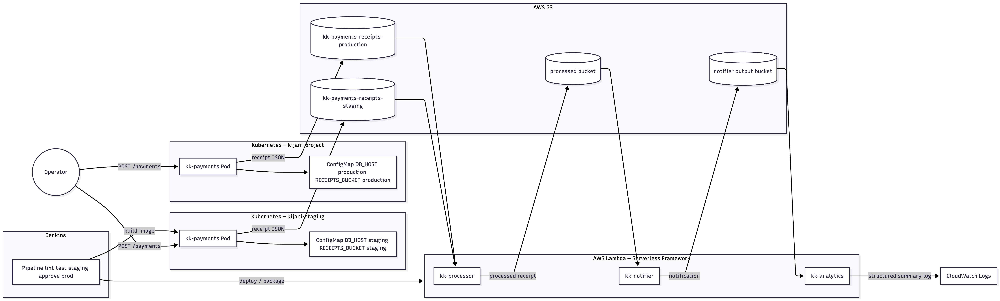

# KijaniKiosk capstone — slide deck (export to PDF)

6–10 slides. Copy each section to one slide.

---

## Slide 1 — Title

**KijaniKiosk end-to-end delivery**  
Brian Kagai Macharia · Track B · Moringa DevOps Capstone

---

## Slide 2 — Problem & scope

- **Problem:** Payments in K8s had no automated receipt → analytics path  
- **Track B:** Serverless chain + K8s producer + Jenkins governance  
- **In scope:** 3 Lambdas, kk-payments→S3, CI/CD with approval gate  
- **Out of scope:** Multi-region, managed RDS

---

## Slide 3 — Architecture

- Labelled flows: `POST /payments` → S3 → processor → notifier → analytics  
- Staging vs production namespaces and buckets

---

## Slide 4 — Key technical decision

**Decision:** Kustomize base + overlays instead of duplicate Deployment files  

| Option | Trade-off |
|--------|-----------|
| Duplicate YAML per env | Simple but drifts on probe/image changes |
| **Kustomize overlays (chosen)** | One Deployment; patches for ConfigMap only |
| Helm chart | Heavier for two environments |

---

## Slide 5 — Pipeline demo

- Merge to `main` → lint/test → package serverless  
- Staging deploy (or offline package when `SKIP_AWS_DEPLOY=true`)  
- Smoke: `npm test` + receipt fixture  
- **Approval gate** with required reason → production

_Screenshot: Jenkins input step_

---

## Slide 6 — AI tooling & governance

- Cursor Agent for serverless + K8s bridge  
- Log: `docs/ai-governance-log.md` (3 entries)  
- Example mistake: Lambda folder named `kk-payments` — caught in review  
- Checklist: `docs/governance-checklist.md`

---

## Slide 7 — Production gaps

| Gap | Remediation |
|-----|-------------|
| AWS account pending | Complete registration; `SKIP_AWS_DEPLOY=false` |
| Static AWS keys in K8s | IRSA / OIDC provider |
| Analytics lists entire bucket | DynamoDB aggregate or SQS batch |
| No Prometheus in cluster yet | Apply `observability/prometheus/alerts/` |

---

## Slide 8 — Peer feedback & outcomes

- 3+ peer issues logged (`docs/peer-feedback-log.md`)  
- `validate-all.sh` added from peer feedback  
- Tests: 3 serverless + kk-payments unit tests

---

## Slide 9 — Live demo checklist

1. `./scripts/validate-all.sh`  
2. Jenkins build (approval gate)  
3. _(When AWS ready)_ `upload-test-receipt.sh` + CloudWatch  
4. _(When cluster ready)_ `smoke-k8s-payment.sh`

---

## Slide 10 — Thank you / Q&A

Repository: https://github.com/MachariaBrian12/kijani-kiosk  
Tag: `v1.0.0` (create before final submit)
